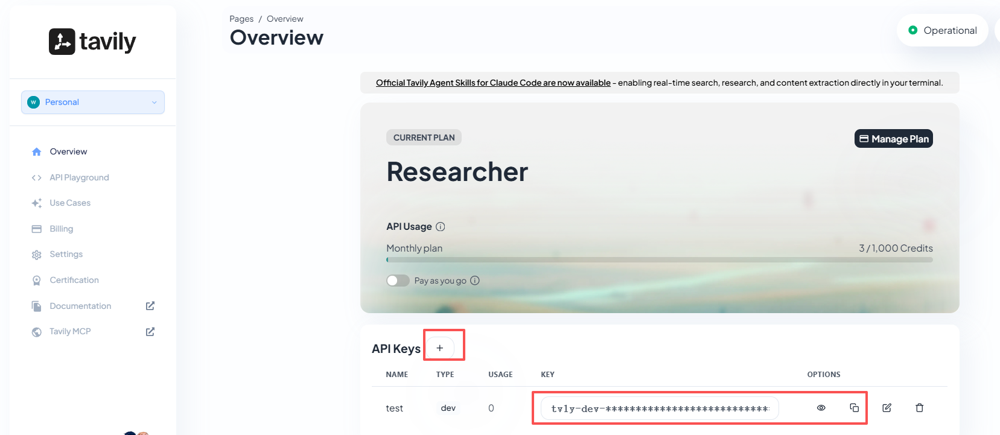

1. # 推荐一些小技巧

## 7.1 联网skills

联网是个大问题hh，可能需要两个方面。一个是主动拉取浏览器，另一个是阅读网址。

这里我们选择使用Tavily作为我们的核心工具~请大家先注册一个账号：

https://app.tavily.com/home

然后需要你新建一个api并复制key~



接着来到ubuntu的界面，输入下面命令并输入y。

```Plain
 npx clawhub@latest install tavily-search
```


装好之后再输入，下面的“apikey”替换为你的key即可~

```Plain
export TAVILY_API_KEY="apikey"
```


接着进入飞书，找一个想用这个技能的agent：

让他查看skill并将刚才我们安装的tavily-searchskill也加进来~


测试通过~


## 7.2 如何优雅地使用**ClawHub** 

下面是一份「**如何优雅地使用 OpenClaw 的 ClawHub**」教程：先讲它是什么、为什么好用，再给你一套从 0 到熟练的使用流程，最后附上我更推荐的新手技能清单（并带上安全注意事项）。

1. ### ClawHub 是什么？（一句话理解）

**ClawHub 是 OpenClaw 的公共 Skills 注册中心/官方商店**：你可以把它理解成「给智能体装插件的 App Store / npm」。Skills 本质上是一个文件夹，核心是 `SKILL.md`（外加一些辅助文件），既能在网页上浏览，也能用 CLI 搜索、安装、更新、发布。([OpenClaw](https://docs.openclaw.ai/zh-CN/tools/clawhub))

1. ### 为什么这个“官方商店”好用？

ClawHub好用主要在这几件事上（都很“工程化”）：

1. **语义搜索（不只关键词）** 它支持基于向量/嵌入的搜索，更适合你用自然语言找能力，比如“帮我管理日历”“连接 Trello”。([OpenClaw](https://docs.openclaw.ai/zh-CN/tools/clawhub))
2. **版本管理像** **npm****：可回滚、可打标签** Skills 支持语义化版本号、变更日志、`latest` 之类标签；每次发布生成版本，标签可移动，天然支持回滚。([OpenClaw](https://docs.openclaw.ai/zh-CN/tools/clawhub))
3. **CLI** **工作流****顺滑：装、更新、同步、发布一条命令** `search / install / update --all / publish / sync` 这些命令把“扩展能力”变成标准化运维动作。([OpenClaw](https://docs.openclaw.ai/zh-CN/tools/clawhub))
4. **可审计/可协作：公开内容、评论星标、（还有审核钩子）** 技能内容（`SKILL.md`）可直接查看；并且有星标/评论等信号；官方文档也提到审核钩子用于审批与审计。([OpenClaw](https://docs.openclaw.ai/zh-CN/tools/clawhub))

1. ### 优雅使用 ClawHub：推荐的“最佳实践”流程

#### Step A：先用网页挑选，再用 CLI 安装（最省心）

- 网页端用来“逛”：看简介、版本、安装量、是否 Highlighted、以及（如果有）安全扫描/报告等信号。
- CLI 用来“装”和“管”：保证可重复、可更新、可同步。

ClawHub 网页上有 **Highlighted**（偏“官方/社区精选信号”）以及 **Hide suspicious**（隐藏可疑内容）的入口，建议你默认开启“隐藏可疑”。([ClawHub](https://clawhub.ai/skills?nonSuspicious=true&utm_source=chatgpt.com))

#### Step B：安装 CLI（一次搞定）

任选其一：(OpenClaw)

```Bash
npm i -g clawhub
# 或
pnpm add -g clawhub
```

#### Step C：搜索与安装（新手最常用）

官方给的最小闭环是：先搜再装：(OpenClaw)

```Bash
clawhub search "calendar"
clawhub install <skill-slug>
```

安装后要让 OpenClaw **重新启动****一个会话**，它才会加载新 skills。([OpenClaw](https://docs.openclaw.ai/zh-CN/tools/clawhub))

#### Step D：把“技能管理”做得更优雅（工作区、锁文件、可重复）

几个关键点：

- **默认安装位置**：CLI 会把 skills 装到当前目录的 `./skills`。([OpenClaw](https://docs.openclaw.ai/zh-CN/tools/clawhub))
- **更推荐做法**：为你的 OpenClaw 项目准备一个“固定工作区”（workspace），让 skills 都进 `<workspace>/skills`，项目更可移植。([OpenClaw](https://docs.openclaw.ai/zh-CN/tools/clawhub))
- **用锁文件掌控状态**：已安装 skills 记录在 `.clawhub/lock.json`，这让“在另一台机器复现同一套技能”更靠谱。([OpenClaw](https://docs.openclaw.ai/zh-CN/tools/clawhub))

常用命令：

```Bash
# 看已安装
clawhub list

# 更新全部（我建议定期做，但要先看变更）
clawhub update --all
```

#### Step E：发布/备份你自己的 skills（进阶但很爽）

当你写了自己的 skill（一个文件夹+SKILL.md），你可以发布备份：(OpenClaw)

```Bash
clawhub publish ./my-skill \
  --slug my-skill \
  --name "My Skill" \
  --version 1.0.0 \
  --tags latest
```

或者用 `sync` 扫描并同步发布多个 skills：([OpenClaw](https://docs.openclaw.ai/zh-CN/tools/clawhub))

```Bash
clawhub sync --all
```

1. ### agent下也可以用几句话轻松搞定安装

这里我用安装：**self-improving-agent 举例：**

前提是你提前装好了clawhub，我用到的prompt如下。但请注意：如果需要apikey （例如Tavily），最好手动安装。

```Plain
安装：self-improving-agent skill 使用clawhub
```


